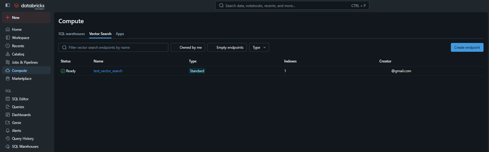
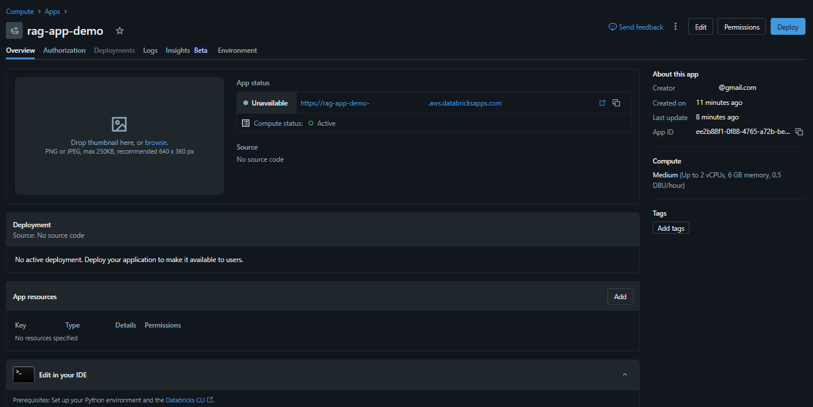
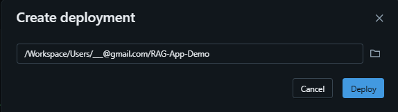
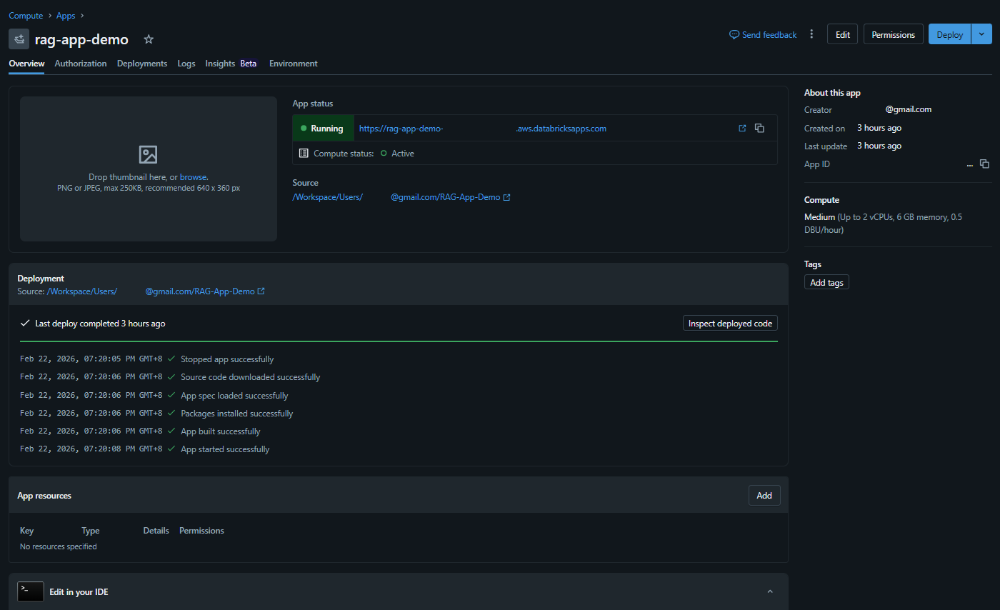
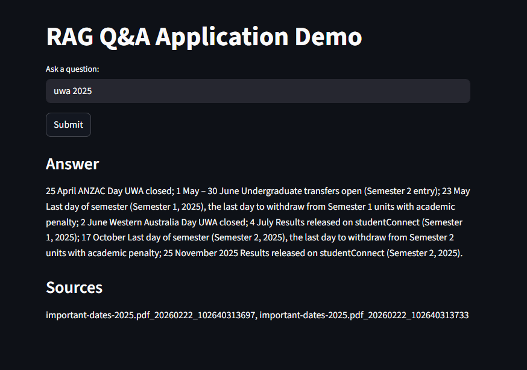
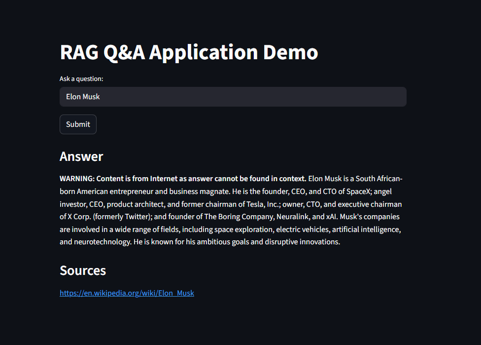

# RAG-App-Demo

## Introduction
This project demonstrates a simple end-to-end Retrieval-Augmented Generation (**RAG**) application on Databricks (tested on **Serverless** compute) using Large Language Models (LLMs), embedding model, Databricks-native vector search APIs, LangChain, MLflow, Streamlit, etc. It uses **Streamlit** as frontend / graphical user interface for question answering over your own document if the document can be found in vector database, else it will get the answer from the Internet.

## Steps
* **Fork** this repository to your repository in Databricks or any IDE tools.
* You must provide your own Databricks **personal access token** and **workspace URL** in **app.yaml** file (never share your personal access token publicly).
* You must execute all cells in **rag_app** notebook file in order to create **relevant tables** and **vector_search_endpoint**.
* You can adjust below variables in **rag_app** notebook file and **app.py** file (applicable to some variables) to suit your environment.
  * llm_model = "databricks-gemma-3-12b"
  * embedding_model = "databricks-bge-large-en"
  * vector_search_endpoint = "test_vector_search"
  * catalog_name = "workspace"
  * schema_name = "my_schema"
  * volume_name = "my_volume"
  * table_doc_text = f"{catalog_name}.{schema_name}.rag_doc_text"
  * table_doc_page = f"{catalog_name}.{schema_name}.rag_doc_page"
  * table_doc_chunk = f"{catalog_name}.{schema_name}.rag_doc_chunk"
  * table_doc_embedding = f"{catalog_name}.{schema_name}.rag_doc_embedding"

* You can modify **rag_app** notebook file if you need to change the data/document ingestion pipeline, chunking strategy, embedding model, etc. Basically this is the core file for RAG development work.
* Below 3 files are required for application deployment in Databricks.
  * app.py
  * app.yaml  
  * requirements.txt
* If you need to install additionally library, you can put it in **requirements.txt** file together with the library version. During deployment, all required libraries will be installed based on **requirements.txt** file.
* Once you have successfully run all cells in **rag_app** notebook file, you will see below vector search endpoint named **test_vector_search**.
* 
* Deployment steps
  * Click on **Compute** on left panel / sidebar, then go to **Apps** tab.
  * In the **Apps** tab, click **Create app** button.
  * In **Create new app** screen, select **Create a custom app**.
  * In **Create new app** screen, for **App name** field, enter **rag**, then click the **Create app** button.
  * It will take a while to create the application instance.
  * Once the application instance is created, then click **Deploy** button.
  * 
  * In **Create deployment** window, select the workspace location when you keep all of the 4 files above and click **Deploy** button to continue.
  * 
  * Once deployed successfully, then you can see below screen.
  * 
  * You can copy the newly generated URL link and paste it in your browser to test it. Alternatively you can launch it by clicking the icon after the URL link.
  * Below screen shows the answer from vector database.
  * 
  * Below screen shows the answer from Internet (with a **WARNING** label) as it cannot retrieve the answer from vector database.
  
  * Databricks will start and run the Streamlit application (using command: streamlit run app.py) automatically.

## References
- https://www.medhakhurana.com/mini-project-rag-pipeline-using-langchain-on-databricks/
- https://docs.databricks.com/aws/en/notebooks/source/generative-ai/unstructured-data-pipeline.html
